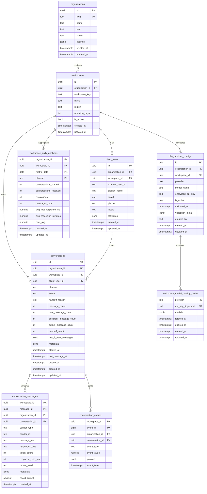

# Supabase Schema Blueprint (Comprehensive + Optimized)

This document describes the production schema in [supabase_comprehensive_schema.sql](supabase_comprehensive_schema.sql), why each table exists, and how to deploy/verify it in Supabase.

## Goals Covered
- Persist all user conversations and messages.
- Keep runtime context of the last 3 user messages persisted for quick guidance.
- Provide client-facing analytics with low-latency reporting.
- Support multi-tenant SaaS isolation.
- Apply high-scale DB optimization techniques (partitioning/shard-like distribution, advanced indexing, materialized analytics, RLS).

## High-Level Design
- Normalized tenant model: organizations -> workspaces -> client_users.
- Conversation model:
  - `conversations` for session metadata + persisted counters + `last_3_user_messages`.
  - `conversation_messages` for immutable message stream.
  - `conversation_events` for analytics/telemetry events.
- Analytics model:
  - `workspace_daily_analytics` (persisted rollups table).
  - `mv_workspace_daily_analytics` (materialized view for derived metrics).
- LLM config model:
  - `llm_provider_configs` and `workspace_model_catalog_cache`.

## Optimization Techniques Implemented
1. Hash partitioning (shard-like)
- `conversation_messages` partitioned by `workspace_id` hash into 8 partitions.
- `conversation_events` partitioned by `workspace_id` hash into 8 partitions.
- Improves write scalability and index maintenance on high-volume tables.

2. Composite + covering indexes
- Query-critical indexes such as `(workspace_id, status, last_message_at desc)`.
- Context index for last user messages with `INCLUDE` columns.

3. Partial indexes
- Context retrieval index only for `sender_type = 'user'`.

4. BRIN indexes
- Append-heavy time scans optimized with BRIN on `created_at`.

5. GIN indexes
- JSONB payload/metadata lookup with `jsonb_path_ops`.
- Text search acceleration via trigram GIN (`gin_trgm_ops`).

6. Trigger-maintained denormalized runtime context
- Trigger updates `conversations.last_3_user_messages` on each user message insert.
- Fast runtime retrieval without expensive joins for every request.

7. Materialized analytics + optional scheduler
- `mv_workspace_daily_analytics` + `refresh_workspace_daily_analytics()`.
- Optional hourly refresh with `pg_cron` when available.

8. RLS baseline policies
- Tenant/workspace isolation policies using JWT claims (`org_id`, `workspace_id`).

## Runtime Context Retrieval (Last 3 User Messages)
Persisted in `conversations.last_3_user_messages` and updated by trigger:
- Trigger: `trg_conversation_messages_after_insert`
- Function: `fn_sync_conversation_after_message_insert`

Fast lookup query example:
```sql
select id, workspace_id, client_user_id, last_3_user_messages
from public.conversations
where id = '<conversation-uuid>';
```

## ER Diagram


## Deployment
### Option A: Automated (recommended)
1. Configure direct Postgres connection in `.env` (either full URL or components):
```env
SUPABASE_DB_URL=postgresql://postgres:<db_password>@db.<project-ref>.supabase.co:5432/postgres

# Equivalent component-based config
SUPABASE_DB_HOST=db.<project-ref>.supabase.co
SUPABASE_DB_PORT=5432
SUPABASE_DB_NAME=postgres
SUPABASE_DB_USER=postgres
SUPABASE_DB_PASSWORD=<db_password>
```
2. Run:
```bash
python tools/apply_supabase_schema.py --schema supabase_comprehensive_schema.sql
```

If direct host resolution fails for `db.<project-ref>.supabase.co`, use the pooler host from Supabase Dashboard -> Project Settings -> Database -> Connection string.

### Current connection validation notes
- REST connectivity to project API can succeed even when direct Postgres host resolution fails.
- If script output shows host resolution failure, use a reachable pooler connection string or execute the schema in SQL Editor.

### Option B: Manual in Supabase SQL Editor
1. Open Supabase dashboard -> SQL Editor.
2. Paste and run [supabase_comprehensive_schema.sql](supabase_comprehensive_schema.sql).
3. Refresh Table Editor.

## Verification Queries
```sql
-- Table existence
select table_name
from information_schema.tables
where table_schema = 'public'
order by table_name;

-- Partition check
select inhrelid::regclass as partition_name
from pg_inherits
where inhparent = 'public.conversation_messages'::regclass;

-- Index check
select indexname, indexdef
from pg_indexes
where schemaname = 'public'
  and tablename in ('conversations', 'conversation_messages', 'conversation_events')
order by tablename, indexname;
```

## Notes
- `conversation_messages` and `conversation_events` are the highest-write tables and are partitioned accordingly.
- If `pg_cron` is not available on your plan/role, analytics refresh remains callable manually via:
```sql
select public.refresh_workspace_daily_analytics();
```
- If you need physical cross-region sharding later, this schema is ready for Citus/distributed expansion using workspace hash boundaries.
